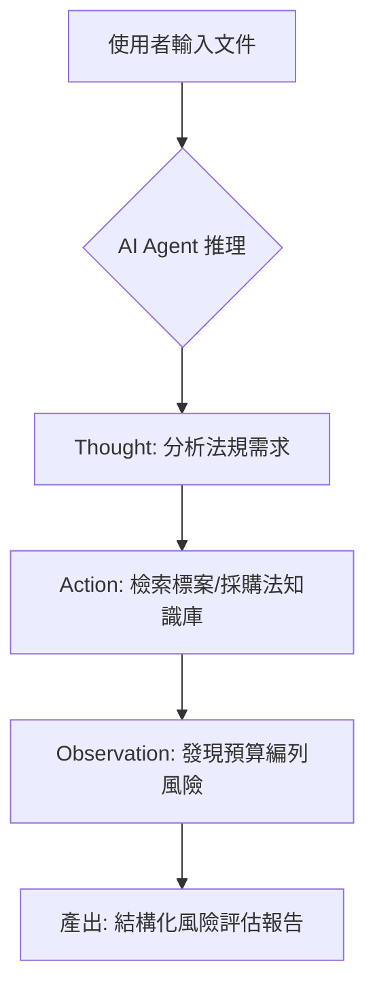
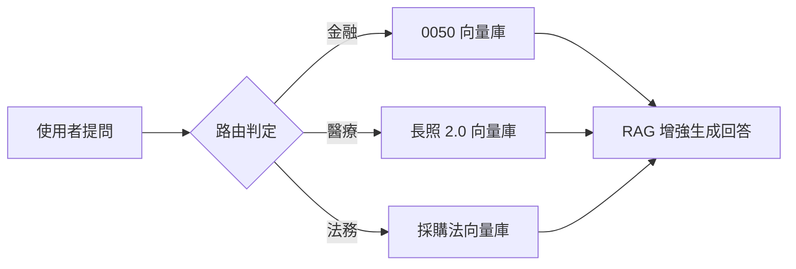
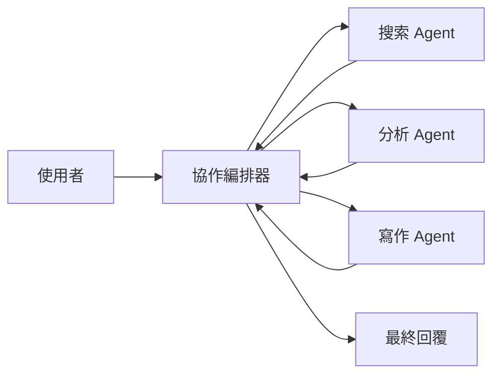
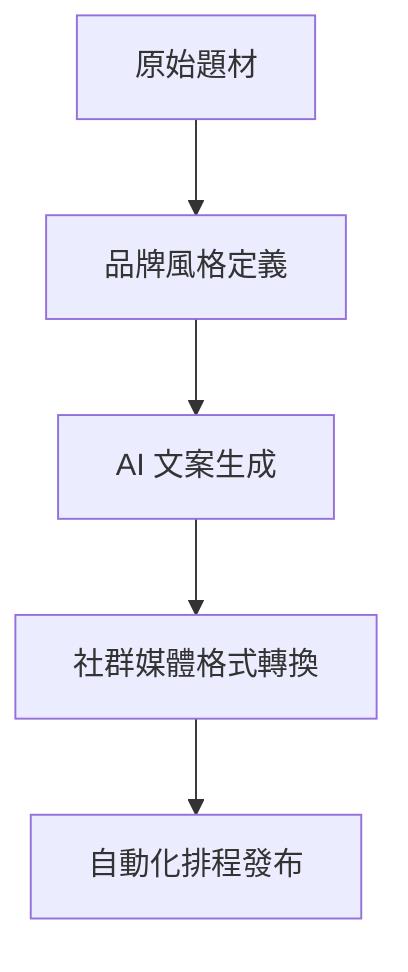
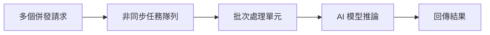

# 🤖 AI MVP Showcase Portfolio

> **專案定位**：這是我在過去 730 天中，針對不同產業痛點開發的 5 個 AI 核心原型 (PoC)。
> 
> 展示 **Agentic AI**、**Multi-RAG**、**MCP 協議**與**非同步推論**等前沿技術的落地實踐。

---

## 🚀 快速導覽 (一鍵啟動)

點擊下方的 **"Open In Colab"** 按鈕，即可在瀏覽器中直接執行各專案的核心邏輯。

| 專案名稱 | 核心技術 | 解決的問題 | 互動 Demo |
| :--- | :--- | :--- | :--- |
| **🏛️ GovAgent** | LangChain ReAct | 政府標案法規自動化評核 |  |
| **📚 MultiRAG** | ChromaDB + RAG | 金融/醫療/法務跨領域檢索 |  |
| **🤖 MCP Agent** | LangGraph + MCP | 多 Agent 協作與工具調用規範 |  |
| **🎯 MarketingBot** | Prompt Eng. | 社群媒體文案自動化與排程 |  |
| **⚡ AsyncInfer** | AsyncIO + Queue | 高併發環境下的模型推論優化 |  |

---

## 🏛️ MVP-A：政府 AI Agent
展示 Agentic AI 在複雜法規環境下的推理與決策能力。

## 📚 MVP-B：多產業 RAG 平台
解決單一 LLM 無法應對專業垂直領域（醫療、金融）知識更新的問題。

## 🤖 MVP-C：MCP Multi-Agent 協作平台
展示基於 LangGraph 的多 Agent 協作與狀態管理能力。

## 🎯 MVP-D：社群行銷自動化 Bot
展示如何利用 Prompt Engineering 將品牌風格穩定地轉化為多平台的社群內容。

## ⚡ MVP-E：非同步推論排程器
針對企業級高併發場景，優化模型推論的吞吐量與穩定性。

---

## 🛠️ 執行與部署 (Technical Setup)

本倉庫所有 MVP 均支援：
- **Docker 化部署**：每個資料夾內含 `Dockerfile` 與 `docker-compose.yml`。
- **Gradio 互動介面**：執行 `python app.py` 即可開啟 UI。
- **FastAPI 整合**：提供生產環境級別的 API 端點。

---
*Developed by Morton Lin | Morton 的 AI 特助系統代行*
