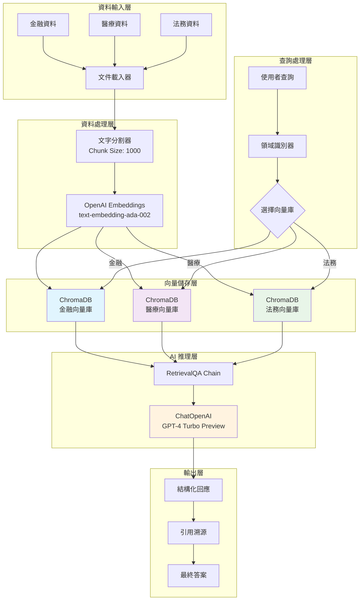
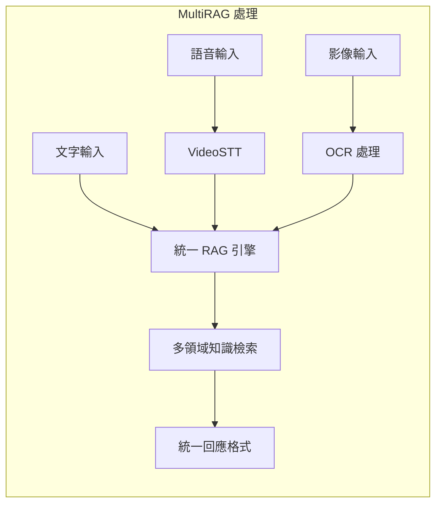
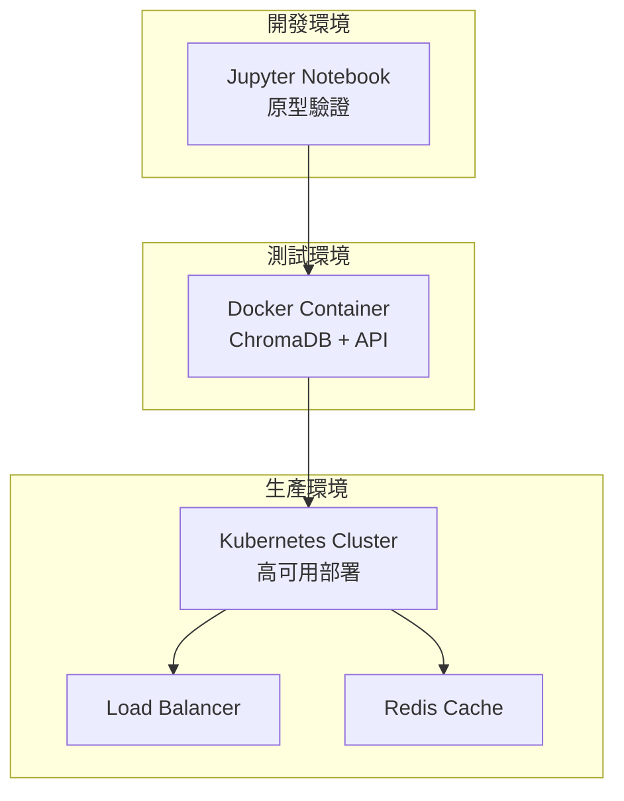

# MVP-B 多產業 RAG 知識庫平台 - 資料流架構圖

## 系統架構圖

## 技術棧說明

### 前端介面
- **Streamlit**: 快速原型開發
- **FastAPI**: 生產級 API 服務

### 核心技術
- **LangChain**: RAG 框架
- **OpenAI**: Embeddings + LLM
- **ChromaDB**: 向量資料庫
- **CharacterTextSplitter**: 文件分割

### 資料流程
1. **載入**: DirectoryLoader 載入各領域 .txt 檔案
2. **分割**: 1000 字元為單位的區塊分割
3. **向量化**: OpenAI embeddings 轉換為向量
4. **儲存**: 按領域分類存入 ChromaDB
5. **檢索**: 基於查詢語意進行向量相似度搜尋
6. **生成**: GPT-4 Turbo 生成自然語言回應

## 多模態處理能力

## 部署架構

---
*技術展示：MVP-B 多產業 RAG 知識庫平台*
